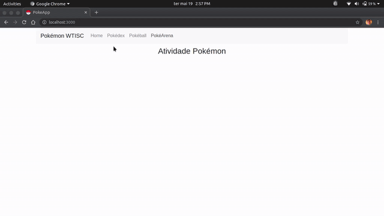

<h1 align="center">
    
</h1>

<h4 align="center">
  🔥 PokeApp
</h4>

## 💻 Projeto

App desenvolvido no minicurso de React do WTISC 2020, com a tutela do prof. [Jefferson Carvalho](https://github.com/jeffersoncarvalho), uma aplicação que consome a [PokeApi](https://pokeapi.co/) e tem o intuito de listar os pokemons e capturá-los. A implementação serviu para treinar as minhas habilidades com a linguagem TypeScript e como desenvolvedor em geral.

## 🎥 Pŕevia da Aplicação

<h1 align="center">
  
</h1>

## ⚡ Tecnologias

- [React](https://pt-br.reactjs.org/)
- [React Bootstrap](https://react-bootstrap.github.io/)
- [Axios](https://github.com/axios/axios)
- [TypeScript](https://www.typescriptlang.org/)

## ⛏ Deploy

- [Netlify](https://5ec422af6145845ee9c9a7f5--pokeapp-ronnyacacio.netlify.app/)

## 🚀 Executando na sua máquina

```sh
$ git clone https://github.com/jvictorfarias/pokeapp.git
$ cd pokeapp
$ yarn && yarn start
```
